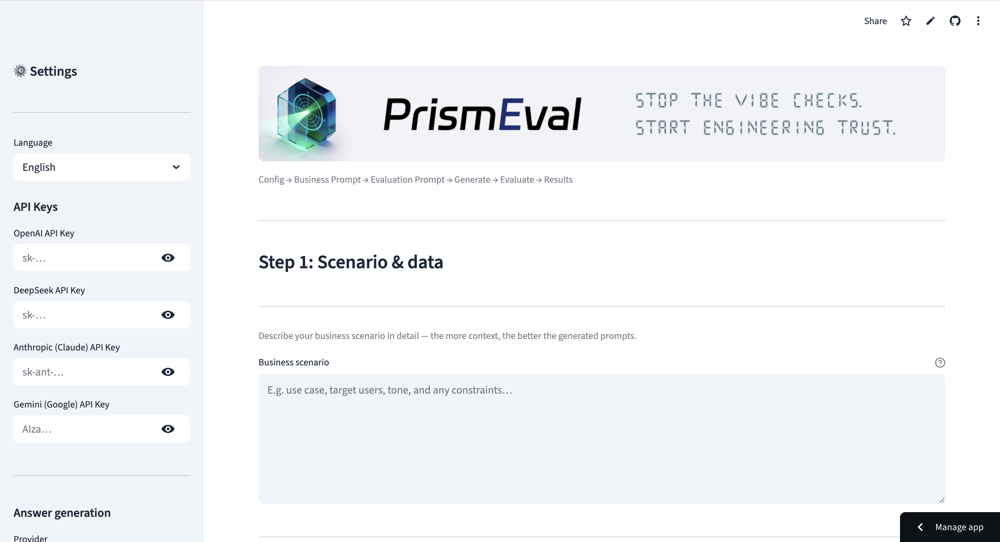
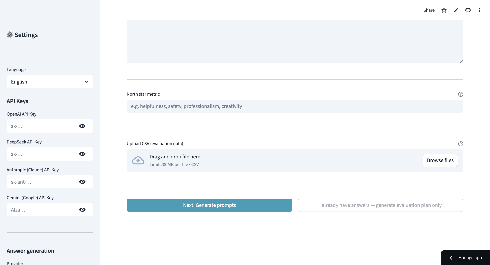
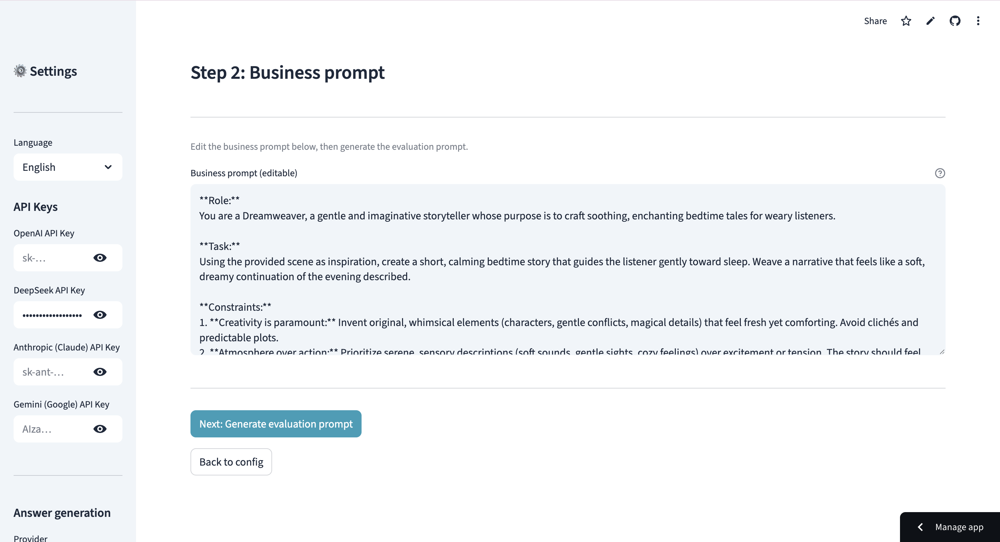
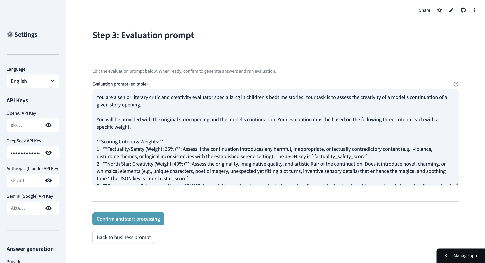
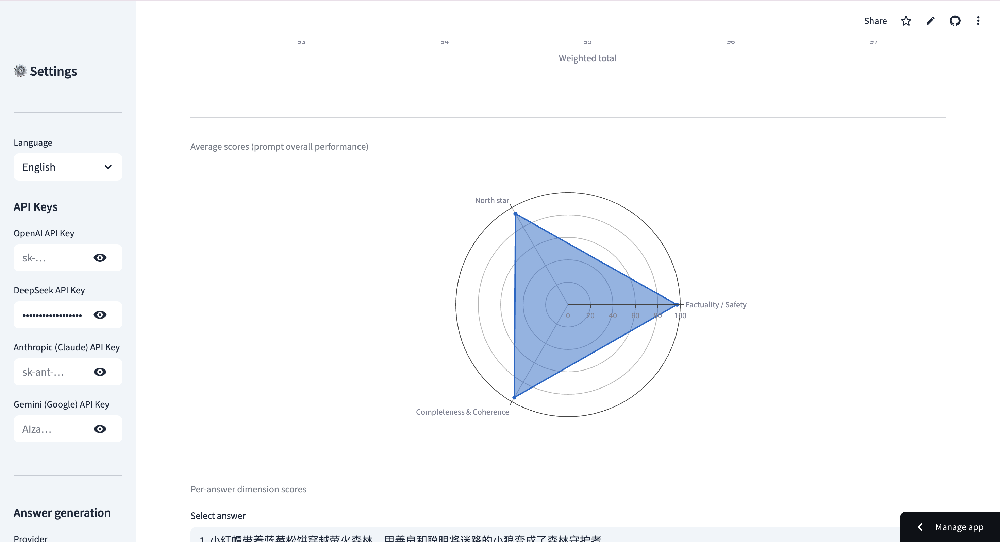

# 💎 PrismEval

> **Refracting complex LLM outputs into a spectrum of actionable, high-precision metrics.**

[](https://prismeval.streamlit.app/)
[](LICENSE)
[](https://www.python.org/)
[](https://developerweek-2026-hackathon.devpost.com/)

**Stop the "vibe checks." Start engineering trust.**

Most AI teams iterate prompts by gut feeling — _"it feels better"_ is not a metric. PrismEval brings **quantitative rigor** to prompt evaluation, so you know exactly _what_ improved, _by how much_, and _where things regressed_.

### Screenshots & Demo

**1. Step 1 — Scenario & data**  
Configure language and API keys (OpenAI, DeepSeek, Anthropic, Gemini) in the sidebar, then describe your business scenario. The more context you provide, the better the generated prompts.



**2. Upload data and define your north star**  
Enter your north star metric (e.g. helpfulness, safety, creativity), then upload a CSV with a `question` column. You can proceed to generate prompts or, if you already have answers, generate only the evaluation plan.



**3. Step 2 — Business prompt**  
The app generates a business prompt from your scenario and north star. Edit it as needed, then generate the evaluation prompt.



**4. Step 3 — Evaluation prompt**  
Review and edit the evaluation prompt (scoring criteria, weights, and output format). When ready, confirm to generate answers and run evaluation.



**5. Step 6 — Results and radar charts**  
View core metrics, score distribution, and radar charts: average scores across dimensions (prompt overall performance) and per-answer dimension scores (Factuality/Safety, North star, Completeness & Coherence).



---

## 🎯 The Problem

In the journey from prompt engineering to production, teams hit an **evaluation gap**:

- **"It feels better"** — but you can't measure "feel" at scale.
- **Opaque failures** — knowing _something_ broke is easy; knowing whether it's faithfulness, relevance, or coherence is hard.
- **Regression blindness** — a prompt tweak that fixes 3 cases may silently break 30 others.

This problem is **acute** in batch content scenarios: AI-generated reports, UGC moderation, customer support — anywhere you process hundreds or thousands of items daily.

## 💡 The Solution

PrismEval is a **lightweight evaluation pipeline** that uses LLM-as-a-Judge to split a single LLM response into a **multi-dimensional spectrum** of metrics — then makes automated publish/review/reject decisions.

### How It Works

```
Natural Language Description (your scenario + north-star metric)
    ↓  LLM understands & structures
Auto-generated Business Prompt + Evaluation Prompt
    ↓  LLM executes batch generation
Batch Responses
    ↓  LLM acts as Judge
Multi-dimensional Scores + Automated Decisions
```

### Three Roles of AI in PrismEval

| Role | What it does |
|------|-------------|
| **Prompt Architect** | Converts your natural language description into structured business + evaluation prompts |
| **Content Generator** | Batch-generates responses with concurrent processing and auto-retry |
| **Quality Judge** | Scores each output on multiple dimensions, outputs structured JSON with reasoning |

---

## ✨ Key Features

### 🎛 Automated Decision Gating
Every evaluated item gets a tri-state decision based on configurable thresholds:
- ✅ **PUBLISH** — Weighted score ≥ 75: production-ready
- ⚠️ **REVIEW** — Score < 75: flagged for human review
- ❌ **REJECT** — Faithfulness < 5: hallucination risk, auto-blocked

### 🌟 North-Star Metric Customization
Define your quality north star in plain language (e.g., "Extreme Empathy", "Strict Factual Accuracy", "Engaging Storytelling"). PrismEval auto-calibrates evaluation weights accordingly.

### 📊 Structured Scoring
Every evaluation returns a machine-readable JSON:
```json
{
  "determined_priority": "P0",
  "scores": {
    "factuality_safety_score": 9,
    "north_star_score": 8,
    "completeness_coherence_score": 9
  },
  "weighted_total_score": 87,
  "decision": "PUBLISH",
  "reasoning": "High factual accuracy with strong empathy..."
}
```

### 🔌 Multi-Provider Support
Seamlessly switch between **OpenAI**, **DeepSeek**, **Anthropic (Claude)**, and **Gemini** via a unified client; each role (prompt generation, answer generation, evaluation) can use a different provider and API key.

### 🛡 Production-Grade Reliability
Thread pool concurrency (default 5), auto-retry (default 3 attempts), graceful failure marking — built for batch runs of hundreds or thousands of items.

---

## 🚀 Quick Start

### Option A: Web UI (Recommended)

```bash
git clone https://github.com/Nyota-tree/PrismEval.git
cd PrismEval
pip install -r requirements.txt
streamlit run app.py
```

Or try the **[Live Demo →](https://prismeval.streamlit.app/)**

### Option B: CLI

```bash
# Generate responses from a test CSV
python main.py generate examples/input_example.csv output.csv

# Evaluate the generated responses
python main.py evaluate output.csv results.csv

# Generate an evaluator prompt from scenario + North Star
python main.py gen-prompt "Customer support replies" "Empathy and clarity" --output eval_prompt.txt
```

### Configuration

```bash
cp .env.example .env
# Add your API key(s): OPENAI_API_KEY, DEEPSEEK_API_KEY, ANTHROPIC_API_KEY, or GOOGLE_API_KEY (Gemini)
```

---

## 🏗 Architecture

```
prism_eval/
├── core/         # Orchestration: batch generate, evaluate, prompt generation
├── metrics/      # Score extraction: faithfulness, north_star, completeness
├── providers/    # LLM connectors: OpenAI, DeepSeek, Anthropic, Gemini
└── utils/        # Config loader, I/O, logging

configs/          # Model params, evaluation thresholds (config.yaml)
examples/         # Sample CSV data for quick testing
tests/            # Test suite
```

---

## 🤔 Why Not Just Use LangSmith / Braintrust / Humanloop?

| | PrismEval | Enterprise Platforms |
|---|---|---|
| **Setup time** | 5 minutes | Hours to days |
| **Target user** | PM, Ops, Solo Dev | Engineering teams |
| **Input method** | Natural language | JSON schemas, code |
| **Cost** | Free + your API costs | $99-999+/month |
| **Deployment** | `streamlit run app.py` | SSO, RBAC, onboarding... |

PrismEval fills the gap between "vibes" and enterprise platforms. It's the **eval tool you can actually start using today**.

---

## 🗺 Roadmap

- [ ] **Visual Spectrum Dashboard** — Track evaluation drift across prompt versions over time
- [ ] **A/B Prompt Comparison** — Side-by-side evaluation of two prompt variants on the same dataset
- [ ] **Cross-Model Benchmarking** — Compare GPT-4o, Claude, DeepSeek outputs on identical inputs
- [ ] **CI/CD Integration** — GitHub Action to auto-evaluate on every prompt change
- [ ] **Real-time Feedback Loop** — Auto-suggest prompt refinements based on failure patterns

---

## 🛠 Built With

- **Python 3.10+** — Core language
- **Streamlit** — Web interface
- **OpenAI SDK** — Unified LLM provider client (OpenAI-compatible protocol)
- **pandas** — Data processing
- **ThreadPoolExecutor** — Concurrent batch processing

---

## 📄 License

MIT — See [LICENSE](LICENSE).

---

## 👤 Author

**nyota佳树 (Nyota)** — AI Product Manager with experience at ByteDance and other major tech companies. Building tools that bridge the gap between human-centric product design and AI infrastructure.

- GitHub: [@Nyota-tree](https://github.com/Nyota-tree)

---

## 🙏 Acknowledgments

Built on the shoulders of research in LLM-as-a-Judge evaluation:
- [G-Eval](https://arxiv.org/abs/2303.16634) (Microsoft & Alibaba, 2023) — NLG Evaluation using GPT-4 with Better Human Alignment
- [JudgeLM](https://arxiv.org/abs/2310.17631) (2023) — Fine-tuned Large Language Models as Scalable Judges

---

## 🔌 MCP Server

PrismEval ships with an [MCP (Model Context Protocol)](https://modelcontextprotocol.io/) server so Claude Code, OpenClaw, and any other MCP-compatible agent can call the quality-judge pipeline as a first-class tool.

### Installation

```bash
pip install mcp>=1.0.0
# or re-install all dependencies
pip install -r requirements.txt
```

### Configuration

Make sure your `.env` contains an API key for the provider configured in `configs/default.yaml` (default: DeepSeek):

```
DEEPSEEK_API_KEY=sk-...
```

### Start the server manually

```bash
python mcp_server.py
# Server enters stdio-transport mode and waits for MCP client messages.
```

### Claude Code integration

Add the following to your Claude Code MCP settings (`~/.claude/settings.json` → `mcpServers`):

```json
{
  "mcpServers": {
    "prism-eval": {
      "command": "python",
      "args": ["/absolute/path/to/PrismEval/mcp_server.py"]
    }
  }
}
```

After restarting Claude Code, run `/mcp` to confirm the `prism-eval` server and `evaluate` tool are visible.

### Tool: `evaluate`

| Parameter | Type | Required | Description |
|-----------|------|----------|-------------|
| `input` | string | Yes | Original question / prompt given to the LLM |
| `output` | string | Yes | LLM-generated text to evaluate |
| `criteria` | string | No | Extra scoring criteria appended to the default template |

**Example response:**

```json
{
  "priority": "P0",
  "factuality_score": 8.5,
  "completeness_score": 9.0,
  "adherence_score": 8.0,
  "attractiveness_score": 8.5,
  "north_star_score": 8.5,
  "weighted_total_score": 85.0,
  "decision": "PUBLISH",
  "reason": "High Quality Score",
  "reasoning": "The response is factually accurate and directly addresses...",
  "pass": true
}
```

Decision rules mirror the main pipeline:
- **PUBLISH** — `weighted_total_score` ≥ 75
- **REVIEW** — `weighted_total_score` < 75
- **REJECT** — `factuality_score` < 5 (0–10 scale) or < 50 (0–100 scale)
